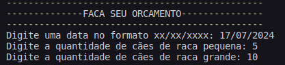
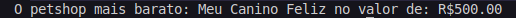

# Teste_Pratico
Teste_Pratico para vaga de estágio DTI

 

  
Foi desenvolvido nesse projeto uma resolução prática para um canil em Belo Horizonte que com os dados informados pelo usuário 
  retornaria o nome do Petshop mais em conta na região. 

  
  
  
Documentação completa do problema se encontra no repositório com o nome: Teste Prático A - Desenvolvimento. 

  
  <h3> Compilação e Execução</h3>
  

  
O algoritmo disponibilizado possui um arquivo Makefile que realiza todo o procedimento de compilação e execução. Para tanto, 
  temos as seguintes diretrizes de execução: 

| Comando                |  Função                                                                                           |                     
| -----------------------| ------------------------------------------------------------------------------------------------- |
|  `make clean`          | Apaga a última compilação realizada contida na pasta build                                        |
|  `make`                | Executa a compilação do programa utilizando o gcc, e o resultado vai para a pasta build           |
|  `make run`            | Executa o programa da pasta build após a realização da compilação                                 |

  <h3> Código </h3>
  
Foi criado um arquivo main.cpp e arquivos da classe Orcamento.hpp e Orcamento.cpp que são desenvolvimento métodos para resolver o problema. 

  <h5>Main.cpp</h5>
  
  
 Ao inicializar o programa é requisitado dados de entrada: Data (xx/xx/xxxx), quantidade de cães de raça pequena (x) e quantidade de 
  cães de raça grande (x). 

  

  
  

  
  
 Foi utilizado a biblioteca "Time.h" para trabalhar com data disponibilizada pelo usuário na função DiaSemana(), onde é analisado
  o ano, mês e o dia e transformado em segundos para retornar o valor da semana de 0 a 6 (Sendo: Domingo = 0 e Sábado = 6) pela função tm_wday 
  disponibilizada na struct tm da biblioteca. Após realizar as movimentações necessárias para setar as variáveis na classe, foi chamado o método Compara 
  que realiza todo o cálculo dos orçamentos de cada Petshop e retorna o de melhor custo.

  
  <h5>Orcamento.cpp</h5>
  
  
 No Orcamento.cpp é possível observar as funções do tipo float para cada petshop(MeuCaninoFeliz(), VaiRex(), ChowChawgas())onde é 
  realizado os cálculos dos valores após a análise do dia da semana, retornando o resultado na variável valor em float. Com isso, na função Compara 
  é atribuido as variáveis do tipo float as funções citadas acima e compara o orcamento de menor custo ou caso houver mais de um orçamento com o mesmo
  valor é retornado ao usuário o orçamento mais próximo dentre desses.

  

  
  

  
  
